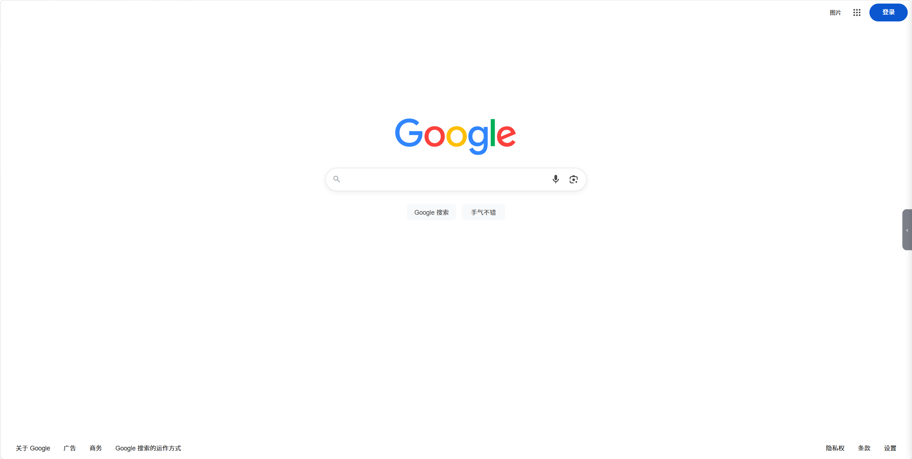
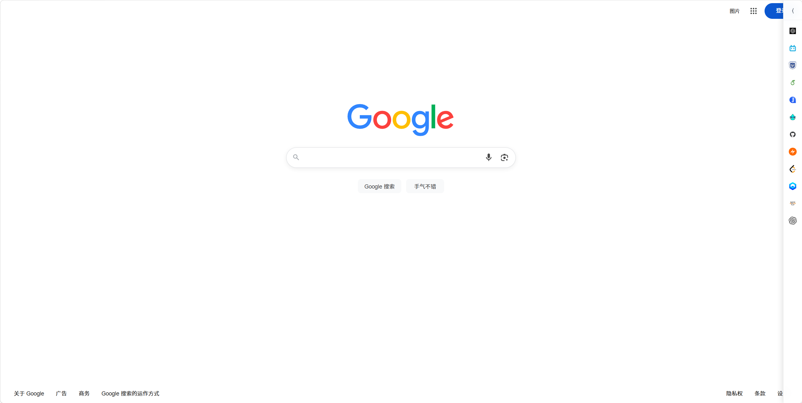
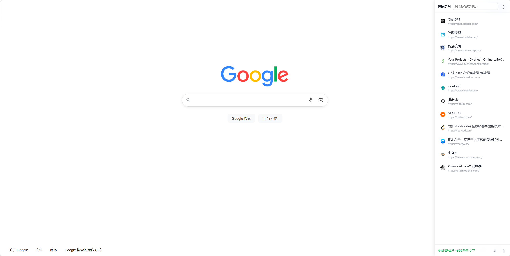
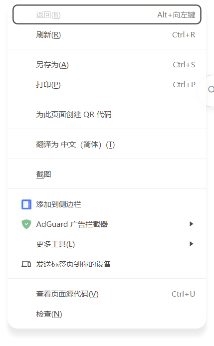

# 快捷侧边栏

微软从 2025 年底开始，把 Edge 侧边栏里「自己添加网站」的那部分逐渐移除了（就是 Sidebar app list，开侧边栏会弹提示说"You can no longer add new apps"）。官方给的替代方案是固定标签页，或者把网站装成 PWA，这两个办法都不太顺手。

## 长什么样

三个状态，宽度是渐进的。点标题就地展开原图，不会跳走。

<details open>
<summary><b>收起状态（22px）</b>：默认就长这样，屏幕右缘一条半透明把手，基本不挡内容</summary>



</details>

<details>
<summary><b>图标条（48px）</b>：鼠标移到把手上，滑出一列网站图标</summary>



</details>

<details>
<summary><b>详情面板（300px）</b>：点图标条顶部的 `⟨` 展开，显示标题和网址，能搜索、编辑、拖拽排序</summary>



</details>

## 怎么用

收藏网页，就是在页面上右键点一下：

<details>
<summary><b>右键菜单截图</b>（点开看）</summary>



</details>

其余操作：

- **打开侧边栏**：鼠标移到屏幕右缘的把手（上面有个 `‹`）
- **自动收起**：鼠标移开就收回把手；正在搜索框里打字、或者正在拖卡片排序时不会收
- **打开某一条**：点图标或卡片，新标签页打开
- **搜索**：面板顶部的输入框，按标题或网址实时过滤
- **改标题 / 改网址**：鼠标悬停在卡片上，点 `✎`
- **删除**：悬停卡片，点 `✕`
- **调顺序**：按住卡片拖到想要的位置
- **备份 / 恢复**：面板底栏 `⇩` 导出 JSON，`⇧` 导入。导入按网址去重，不会产生重复项
- **整个隐藏 / 显示**：点浏览器工具栏上的扩展图标切换

## 安装

两种装法。商店版最省事；本地加载不用等审核，适合想自己改代码的。

### 方法一：从商店安装

**[在 Microsoft Edge 加载项商店打开](https://microsoftedge.microsoft.com/addons/detail/peknbpblahpilbkjehlcjnekielmpbci)**

可能还搜不到（商店的关键词索引有延迟），直接点上面的链接进去就行。

### 方法二：本地加载

1. 把这个仓库下载或克隆下来
2. 打开 `edge://extensions/`
3. 打开左下角「开发人员模式」
4. 点「加载解压缩的扩展」，选仓库根目录（有 `manifest.json` 的那层）

仓库里的 `manifest.json` 保留了商店用的 `key`，所以本地加载出来的扩展 ID 跟商店版一样，收藏数据互通，换个装法不会丢数据。

## 数据存在哪

存两处，一份数据：

1. 优先写 `chrome.storage.sync`，同时镜像一份到 `storage.local`
2. 读的时候先读 sync，没有才读 local
3. sync 单个键有 8KB 上限，数据超过 7000 字节就只存本机，并把 sync 里的旧副本清掉，免得两边不一致
4. 老版本的数据存在 local，升级后第一次运行会自动搬到 sync，只搬一次

登录同一个浏览器账号并打开同步，换电脑之后收藏会自己回来。面板底栏会显示当前同步状态和云端占用，同步不可用的时候会直接告诉你「数据存本机」，不会假装成功。

工具栏那个显示 / 隐藏的开关是故意只存在本机的，不跟着账号同步，因为它算设备偏好。

## 实现说明

- Manifest V3，`background.js` 跑在 service worker 里。没有第三方依赖，两个文件加起来约 900 行
- 界面全部写在 `content.js` 里的一段 Shadow DOM 里。网页的 CSS 影响不到它，它的 CSS 也影响不到网页，不用写 `!important` 去跟页面打架
- 刷新靠 `storage.onChanged`：右键添加、其他标签页改了、别的设备同步过来，已经打开的页面都会实时更新
- 图标 `` 加了 `referrer-policy: no-referrer`，因为不少 CDN 看到 referer 就不给图。加载失败或者 5 秒没回来，会换成内置的地球线框 SVG
- `crypto.randomUUID` 有降级实现，因为 `http://` 页面不是安全上下文，拿不到这个 API
- 切换标签页时会自动收起，免得切回来还留着展开的面板

## 目录

```
quick-sidebar/
├── manifest.json
├── background.js      右键菜单、工具栏开关、数据读写
├── content.js         侧边栏界面和交互
├── icons/             16 / 48 / 128
└── docs/screenshots/
```

## 常见问题

**本地加载之后以前收藏的都没了**

扩展 ID 变了。按上面「本地加载」的步骤做，`key` 字段会保证 ID 跟商店版一致，数据不会丢。

**Chrome 能用吗**

代码用的都是标准的 `chrome.*` API，可以用。但 `manifest.json` 里的 `update_url` 指向的是 Edge 商店，在 Chrome 里要把那一行删掉再用开发者模式加载。

**数据传到哪去了**

存在你自己浏览器账号的同步空间里。扩展本身不联网，不上传任何东西。

## 更新日志

**3.1.0** — 商店在架版本。三态侧边栏、自动收起、搜索 / 编辑 / 删除 / 拖拽排序、账号同步、JSON 备份。
